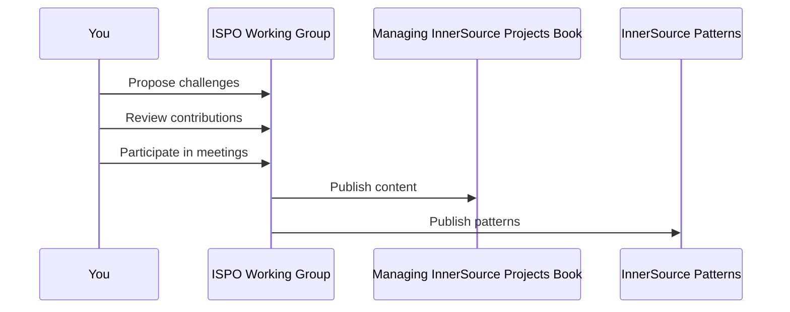

# How Do I Contribute to the ISPO Working Group?

Welcome!

Every person creating InnerSource-related content or tools within their
company should contribute to this working group.

This working group is a collaborative space where we all can get feedback on
our work and share it. By doing so, we not only improve individually but also
help others to leverage our collective knowledge and experience.

Check out our [README.md] for more details.

## Ways to Contribute



### Attend a meeting

The [InnerSource Commons Slack] [#ispo-working-group] community will post the
next meeting.

### Review others' content

1. Find something interesting on the [Kanban board].
1. Write a comment on an interesting card.

### Add a challenge to our [Kanban board]

InnerSource solutions to challenges are discovered, produced, and spread in
this working group. Contributions improve content in the
[Managing InnerSource Projects] book, [InnerSource Patterns] book, or
[InnerSource Learning Path] segment.

Slides, spreadsheets, and other artifacts not easily represented elsewhere can
go in the [ISPO Working Group GDrive]. Be sure to attribute all the
contributors to the resulting work (e.g., in the _Authors_ or
_Acknowledgements_ sections of Patterns).

To contribute, get access to the board by [joining the ISPO Working Group team].

We track the production of our content on a [Kanban board] with the following
columns:

1. **Challenge**. This means that we've identified such-and-such a thing as a
   challenge.
1. **In Progress**. Someone is working on a proposal for a solution to the
   challenge.
1. **Proposed**. We have a proposal for a solution to the challenge.
   This could be to write an article, code up a tool, create a training video,
   etc.
1. **Internal**. We have implemented the solution internally in a company.
1. **External**. We have made the solution available externally.
1. **Adopted**. At least one company is using the solution.

In our meetings, we propose new challenges, discuss ideas, and demo solutions.

1. Create a new card in the **No Status** column describing your contribution
   and the challenge it helps solve.
1. Assign the new card to yourself by clicking the link on the card.
1. Check if your contribution relates to existing [InnerSource Patterns].
1. Learn more about the next Working Group meeting by joining
   [#ispo-working-group] in the [InnerSource Commons Slack] workspace.
1. During our meetings, discuss your card and what you plan to contribute.

### Lead or make Project contributions

Learn about ongoing projects in regular meetings or [discover open projects](https://github.com/InnerSourceCommons/ispo-working-group/projects?query=is%3Aopen).

Use our [Project Template] to create a new project.

## To add documentation to this repository and the corresponding website

Simply send a pull request to this repository to contribute.
Note that the rendered website at
<https://innersourcecommons.github.io/ispo-working-group/> is using a Jekyll
theme that comes from
<https://github.com/InnerSourceCommons/working-group-roles>.
Some elements you see in the rendered webpage are coming from the theme
(e.g. the roles), so you may have to contribute there instead.

### How to develop and test locally

Here you can find information on how to test your changes locally, without
having to deploy the content to GitHub pages.

### With a native Ruby setup

Install the dependencies with the command:

```sh
bundle install
```

Run jekyll locally to serve the website with the command:

```sh
jekyll serve
```

You should be able to access the website at <http://localhost:4000/ispo-working-group/>

### With a Docker Compose

If you have an environment able to run containers that is compatible with
_Docker Compose_ (e.g. Docker Desktop or Podman), run the website locally with
the following command:

```sh
docker compose up
```

You should be able to access the website at <http://localhost:4000/ispo-working-group/>

[Kanban board]: https://github.com/orgs/InnerSourceCommons/projects/4/views/1
[joining the ISPO Working Group team]: https://github.com/InnerSourceCommons/ispo-working-group/issues/new/choose
[#ispo-working-group]: https://app.slack.com/client/T04PXKRM0/C04DT6NQX7G
[InnerSource Commons Slack]: https://innersourcecommons.org/slack
[README.md]: ./README.md
[InnerSource Learning Path]: https://github.com/InnerSourceCommons/InnerSourceLearningPath
[ISPO Working Group GDrive]: https://drive.google.com/drive/folders/1zhP_wQQFf1cIHnkTUZtBGuLhEUYXzvlC
[Project Template]: https://github.com/orgs/InnerSourceCommons/projects/18?query=is%3Aopen+sort%3Aupdated-desc
[InnerSource Patterns]: https://github.com/InnerSourceCommons/InnerSourcePatterns#list-of-patterns
[Managing InnerSource Projects]: https://github.com/InnerSourceCommons/managing-inner-source-projects
