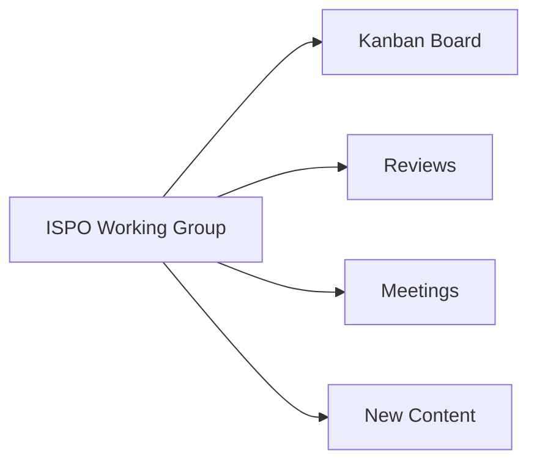

Welcome!

Every person creating InnerSource-related content or tools within their company should contribute to this working group.

This working group helps all to get feedback on this work and to share it so that others can leverage it as well.

Check out our [README.md] for more details.

## Ways to Contribute



1. [Kanban board].

    * Get access to contribute to the board by [joining the ISPO Working Group team].

2. Review others' content.

    * Find something interesting on the [Kanban board].
    * Write a comment on the card indicating your interest.

3. Attend a working group meeting.

    * The [InnerSource Commons Slack] [#ispo-working-group] community will post the next meeting.

4. New content.

    * Add or improve content in the [Managing InnerSource Projects] book.
    * [Add the InnerSource metrics](https://github.com/InnerSourceCommons/managing-inner-source-projects/blob/master/CONTRIBUTING.md#metrics) that you're tracking to the [industry graph](https://github.com/InnerSourceCommons/managing-inner-source-projects/blob/master/measuring/use_gqm.md).
    * If it's a pattern, go ahead and contribute to the [InnerSource Patterns] project.
    * Contribute training segments to the [InnerSource Learning Path] project.
    * Add slides, spreadsheets, and other artifacts not easily represented elsewhere to the [ISPO Working Group GDrive]  
    * Documents that don't fit the previous categories (e.g., graphics, opinionated documents, etc.) can go directly into this `ispo-working-group` repo as markdown.

Regardless of where the content is created, you should attribute all the contributors to the resulting work (e.g., in the _Authors_ or _Acknowledgements_ sections of Patterns).

## Kanban Board

InnerSource solutions to challenges are discovered, produced, and spread in this working group.

We track this production on a [Kanban board] with the following columns:

1. **Challenge**.  This means that we've identified such-and-such a thing as a challenge.
1. **In Progress**.  Someone is working on a proposal for a solution to the challenge.
1. **Proposed**.  We have a proposal for a solution to the challenge.
This could be to write an article, code up a tool, create a training video, etc.
1. **Internal**.  We have implemented the solution internally in a company.
1. **External**.  We have made the solution available externally.
1. **Validated**.  More than one company is using the solution.

A regular meeting proposes new challenges, discusses ideas, and demos solutions.

 * Create a new card in the **No Status** column describing your contribution and the challenge it helps solve.
 * Assign the new card to yourself by clicking the link on the card.
 * Check if your contribution relates to existing [InnerSource Patterns].
 * Learn more about the next Working Group meeting by joining [#ispo-working-group] in [InnerSource Commons Slack].
 * During our meetings, discuss your card and what you plan to contribute.


Solutions are often shareable with other InnerSource Commons working groups (e.g., [Patterns][InnerSource Patterns], [Learning Path][InnerSource Learning Path]).

[Kanban board]: https://github.com/orgs/InnerSourceCommons/projects/4/views/1
[joining the ISPO Working Group team]: https://github.com/InnerSourceCommons/ispo-working-group/issues/new?title=Please%20add%20me%20to%20the%20ispo-working-group%20team```
[#ispo-working-group]: https://app.slack.com/client/T04PXKRM0/C04DT6NQX7G
[InnerSource Commons Slack]: https://innersourcecommons.org/slack
[README.md]: ./README.md
[InnerSource Learning Path]: https://github.com/InnerSourceCommons/InnerSourceLearningPath
[ISPO Working Group GDrive]: https://drive.google.com/drive/folders/1zhP_wQQFf1cIHnkTUZtBGuLhEUYXzvlC
[InnerSource Patterns]: https://github.com/InnerSourceCommons/InnerSourcePatterns#list-of-patterns
[Managing InnerSource Projects]: https://innersourcecommons.org/learn/books/managing-innersource-projects/
