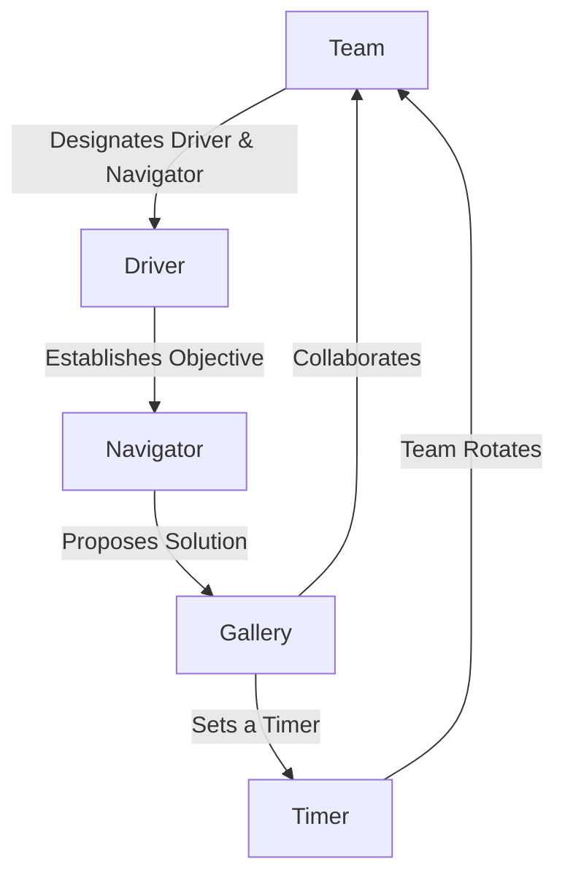

# Mobbing

## What Is A Mobbing Session?

A mobbing session, also known as mobbing or a mob, is a collaborative software and content development technique where **a team** *works together* on a single task. During mobbing, we focus our efforts on **one project with clear objectives**.

Mobbing sessions improve artifact quality, reduce defects, speed up knowledge transfer, increase team collaboration and learning, and foster shared ownership and responsibility among team members.

## How Does A Team Conduct A Mobbing Session?

1. *Establish* concise short-term objectives to tackle
2. *Introduce* each voluntary role
   1. **Driver** — A person who *types*
      - Consider having a co-driver to *clean up grammar and typos*
   2. **Navigator** — A person who *proposes solutions to the problem*
   3. **Gallery** -— People who *observe, suggest, add TODOs and research*
3. *Designate* the first **Driver** and **Navigator**
4. **Gallery** *sets a timer*
   - Try this with [a Google timer] (~15 min)
5. **Gallery** *rotates* at the timer’s end
6. **Driver** *joins* the **Gallery** 
   1. **Navigator** *becomes* the **Driver**
   2. A **Gallery** member *becomes* the **Navigator**
7. *Reset the timer* and *repeat*

[a Google timer]: https://www.google.com/search?q=15+minute+timer+google
