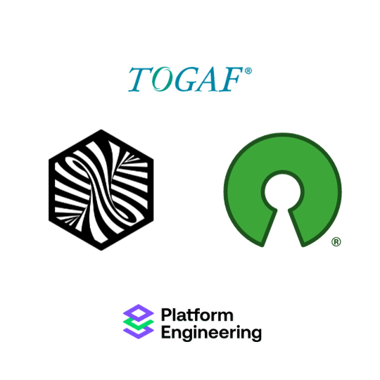

# The InnerSource Program Office (ISPO) Working Group
<!---  Slide 1: Opening Statement --->

The InnerSource Program Office (ISPO) Working Group creates resources for enterprise InnerSource teams.

<!--
Hello, Jeff and I are going to talk to you today about the 
ISPO Working Group, which is a working group within the InnerSource commons 
devoted to creating shared resources for people working on InnerSource at an Enterprise level.
-->

<!-- --- -->

<!--- Slide 2: Key Message --->
<!-- 
If you're in any of these groups, we invite you to join us:

* InnerSource responsibilities in an Open Source Program Office (OSPO)
* Platform Engineering Teams
* Other centralized groups such as Enterprise Architecture -->

<!-- Slide 2: Key Message  

--> 

---

<!--- Slide 3: Key Message --->

But what is an InnerSource Program Office (ISPO)?

"Person(s) working on improving the internal code collaboration experience at full organization scale"

<!-- Slide 3: Key Message 

Technically, ISPO is an acronym. 
It stands for InnerSource Programs Office. 

Often the people doing ISPO related work in a company aren't in a team called ISPO.

They are in a team with larger scope of responsibilities and InnerSource is 
one aspect. For convience, we say ISPO.

-->

---

<!--- Slide 4: Key Message --->

## Lots of overlap

You don't formally need an ISPO team for this content to be useful

You might be concerned with InnerSource in any of these other teams.
<!-- Slide 4: Key Message:  

People trying to improve InnerSource across an entire enterprise or company 
sit in different types of team. 

They might be in a team called the OSPO, or open source programming office, 
or part of a centralized engineering team, or platforms team. 

They also could be single person working under a head engineering or as part of 
an engineering community of practice. 

It is variable... and for our purposes though, it is just someone with InnerSource responsibilities (however you define that) at company scale.

-->

---

<!--- Slide 5: Key Message --->

Q: WHY is the ISPO working group a subset of InnerSource Commons?

A: We focus on accelerating teams that run and support InnerSource across an organization rather than individuals.
<!-- Slide 5: Key Message:  
The important way in which the ISPO working group is a little different than 
other InnerSource Commons efforts..

I that we try to focus on guidance for
the teams that run and support InnerSource across an organization rather than guidance for projects or individuals. 

For example, in the InnerSource Commons patterns, there is guidance 
for how to be a good InnerSource maintainer and guidance on how to set up 
your project for InnerSource success. Those are important areas, but outside of
the working groups focus.

We focus on guidance, tools, policies, methods, etc. run or owned by a centralized 
team.

-->

---

<!--- Slide 6: Key Message --->

Our objective is to help you discover the benefits of our ISPO working group.

https://github.com/InnerSourceCommons/ispo-working-group/blob/main/CONTRIBUTING.md

<!-- Slide 6: Key Message

Our goal for this talk is to help you discover the benefits of the 
ISPO working group. In addition to the content in this talk, you can 
check out the contributing.md file of the ispo-working-group repository for 
information on how to get started with the working group.

https://github.com/InnerSourceCommons/ispo-working-group/blob/main/CONTRIBUTING.md
-->

---

<!--- Slide 7: Key Message --->

By participating in our working group 
**YOU** can increase the speed and impact of **YOUR** InnerSource Program Office.

<!-- Slide 7: Key Message

We have structured the working group such that 
by participating in our working group we can increase the speed and impact of your InnerSource Program Office.

The goal is to created shared products, guidance docs, 
methodology descriptions, etc. 
These get peer reviewed from other InnerSource experts, and then reused 
by internally by yourself and by others.

This improves the quality of your work through peer review from external experts, 
and lets you reuse the content internally without having to maintain it or create it
just by yourself.
-->

---

<!--- Slide 8: Key Message --->

Examples of products we are working on specifically for teams that drive InnerSource company-wide:

* InnerSource Project Metrics
* SCM (Source Code Management)
* InnerSource Project Assessment and Linting

<!-- Slide 8: Key Message

Examples of products we are working on specifically for teams that drive InnerSource company-wide:

* InnerSource Project Metrics
* SCM (Source Code Management)
* InnerSource Project Assessment and Linting

Our focus is to support the people/teams that do InnerSource organization-wide

These are all areas where many people in the working group have tried different things, have different lessons to share, 
and want to hear how things they are actively considering have worked out at other companies. 
-->

---

<!--- Slide 10: Key Message --->

#### Source Code Management (SCM) is: 

"How do you set up GitHub, GitLab, etc. configuration at an enterprise level to best balance security and collaboration?"

<!-- Slide 10: Key Message 
One area I have contributed to is in defining guidance for 
source code management or SCM.

SCM refers to how you set up or configure a version control platform like 
GitHub, GitLab, Bit Bucket, etc. There are lots of decisions to be made in 
how these platforms are set up and different needs have to be balanced.

Shown on the page is a screenshot of one part of our in-process guidance documentation that discusses how to balance needs for security 
and collaboration. 
These conflicting needs can sometimes conflict resulting in 
disagreements regarding what configuration settings to use. 
And in a worst case scenario, a single security 
event can result in a sudden lock down across the enterprise when other configuration options could be addressed 
the security need without shutting off so much collaboration potential.

The purpose of this part of ISPO working group is to generate guidance 
documents that create a framework for making good configuration choices
in version control platforms that balance the various needs, like security
and collaboration. 
-->

---
<!--- Slide 11: Key Message --->

What did I get from contributing to Source Code Management project?

<!-- Slide 11: Key Message

 Why did I contribute to Source Code Management project (Justin)
 1. Get more value from hard won lessons by sharing them with others externally. 
 2. Want my perspective in external resources so I can refer to it rather than it just being Justin's opinion written in an email.
 3. Want to confirm my opinion is aligned with others who have struggled through this at their company as this makes me more confident when I make a position internally. 
 4. Sharing makes it more likely InnerSource Commons people give you feedback on unrelated areas. They are more likely to spend their time on you.
-->

---

<!--- Slide 12: Key Message --->

***Example InnerSource Metrics***

👀 **Usage count** — how many times the InnerSource project is used.
🤝 **Code contributions** — Count of commits not from the project owner.

<!-- Slide 12: Key Message 

What are InnerSource Metrics?

To demonstrate the value of InnerSource, we need to measure it. As ISPO leaders, we're often asked to articulate the value of InnerSource to our stakeholders. Using the InnerSource Metrics project, we can measure the value of InnerSource meaningfully to our stakeholders.

For example, usage count demonstrates the reuse of code or other valuable artifacts that would otherwise be duplicated, and code contributions demonstrate collaboration's value, leading to trust and longer employee retention.

We've built a graph of Goals, Questions, and Metrics to help you answer your stakeholders' questions.
-->

---
<!--- Slide 13: Key Message --->

How did I benefit from collecting goals, questions, and metrics?

<!-- Slide 13: Key Message

Through my involvement in the metrics project, I didn't just gather data; I built a network. I connected with professionals who, like me, were navigating the world of InnerSource metrics. This wasn't just about numbers but about people facing similar challenges.

As I contributed to this project, my professional network grew exponentially. As a result of these efforts, I'm connected to great, like-minded professionals ready to help expand the value of the InnerSource Commons.

Looking ahead, this experience isn't a one-time benefit. It's an investment in the future. When my company expands InnerSource project measurement, we'll be steps ahead, armed with knowledge, connections, and a deep understanding of diverse approaches.

-->

---

<!--- Slide 14: Key Message --->

## How the ISPO working group operates

🚀 ***Progress over perfection*** — Even if a solution doesn't work for all companies, we'll still put it out there. We can iterate and add more to it later.
🧩 ***Solve your challenges*** — Take the challenges that you are already solving and use this working group to get external feedback. We do not expect others to solve our challenges for us.

<!-- Slide 14: Key Message

Through conversations, ideation, and sharing our challenges, we work together to build peer-reviewed content fit for your organizations.

We value progress over perfection, and encourage you to share your challenges and solutions with us.

-->

---

<!--- Slide 15: Key Message --->

## When?

### Asynchronously

💬 Slack  
⛙ GitHub Repositories  
📋 GitHub-based Kanban board  

### Synchronously

📆 Biweekly working group meetings  
👥 Mobbing sessions  

<!-- Slide 15: Key Message

You welcome to attend each biweekly meeting, work asynchronously, or drop in when available. 

-->

---

<!--- Slide 16: Key Message --->

## How Do I Contribute?

1. Kanban board *(GitHub)*
2. Peer review *(GitHub)*
3. Focus on external products useful to others
   * Markdown books, website pages, and anything linkable from inside company resources or added to them.

<!-- Slide 16: Key Message

All work within the working group undergos peer review as is progresses through the Kanban board. We align our work with the goals and objectives of our companies while also contributing to the InnerSource Commons.

We contribute to the Managing InnerSource Projects Gitbook, InnerSource Patterns, and other projects relevant to leaders of ISPOs, OSPOs, and the like.

-->

---
<!---  Slide 17: Closing Point of View --->

***The ISPO working group can be your force multiplier!***

🏗️ Produce content at a lower cost collaboratively  
🔄 Get feedback from deeply experienced people  

<!-- Slide 17: Closing Point of View

We invite you to align your company backlog with the work we are doing in this working group. As a result, you can produce content at a lower cost collaboratively and get feedback from deeply experienced people. 

If your backlogs include references to building content in the ISPO working group, we're all winning.

-->

---

<!---  Slide 18: Specific Action --->

Attend an ISPO working group meeting

Get meeting invites by adding an issue:

https://github.com/InnerSourceCommons/ispo-working-group/issues/new

<!-- Slide 18: Specific Action: DO THIS ONE THING RIGHT NOW 

Attend the ISPO working group meeting on November 20th at 8 AM, or join us for the next one two weeks later. 

-->

---

<!---  Slide 19: Benefits of Action --->

Our InnerSource Working Group has the same benefits as open source.

<!-- Slide 19: Benefits of Action

We already know the benefits of Open Source. Our InnerSource Working Group provides you the same benefits. 

Collaboration opportunities, code reuse, knowedge sharing through community, and more.

-->

---
<!---  Slide 20: Closing Statement --->

**Collaborate with us!**

* GitHub repository: https://github.com/InnerSourceCommons/ispo-working-group
* Kanban board: https://github.com/orgs/InnerSourceCommons/projects/4 
* Join our slack group: https://innersourcecommons.org/community/#ispo
* Get meeting invites: https://github.com/InnerSourceCommons/ispo-working-group/issues/new

<!--- Slide 20: Closing Statement

In conclusion, the InnerSource Program Office (ISPO) Working Group represents a unique opportunity for those involved in enterprise-level software development and collaboration.

Whether you're a member of an OSPO, a Platform Engineering Team, or a centralized group like Enterprise Architecture, the resources and knowledge shared within this group are indispensable.

By joining the ISPO Working Group, you're not just accessing a rich repository of InnerSource strategies and tools; you're becoming part of a community dedicated to refining and advancing the art of internal code collaboration.

Our collaborative space allows you to contribute and benefit from a wealth of shared knowledge and experience, enhancing your organization's InnerSource capabilities.

Remember, the ISPO Working Group is more than just a repository of information—it's a dynamic, collaborative environment where each member plays a crucial role in shaping the future of InnerSource. So, don't miss out on this chance to amplify your impact, refine your skills, and contribute to a thriving community. 

Join us at the InnerSource Program Office Working Group, and let's revolutionize software development practices within our organizations.

--->
