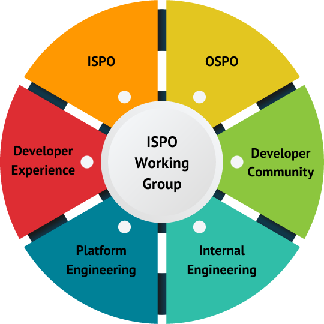
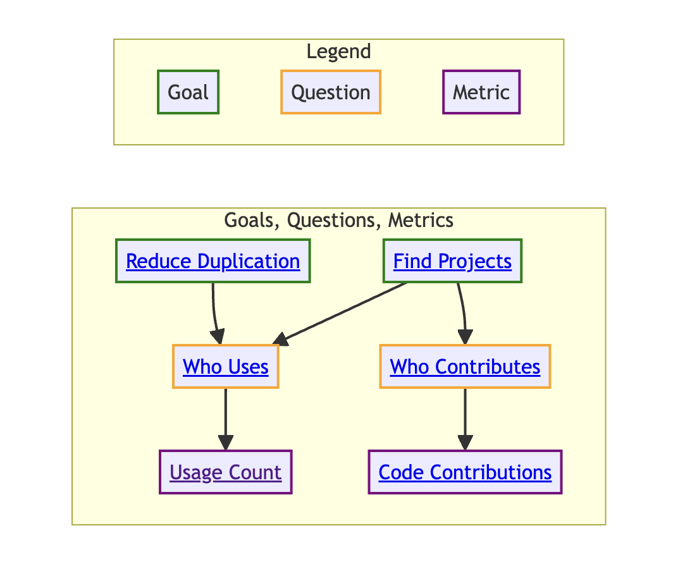
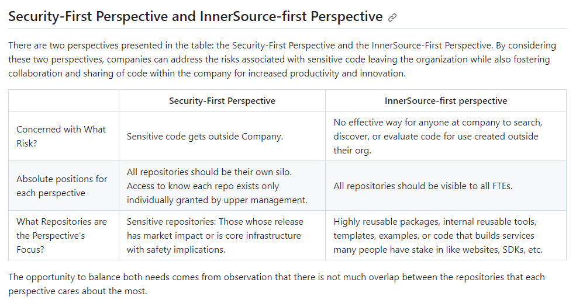
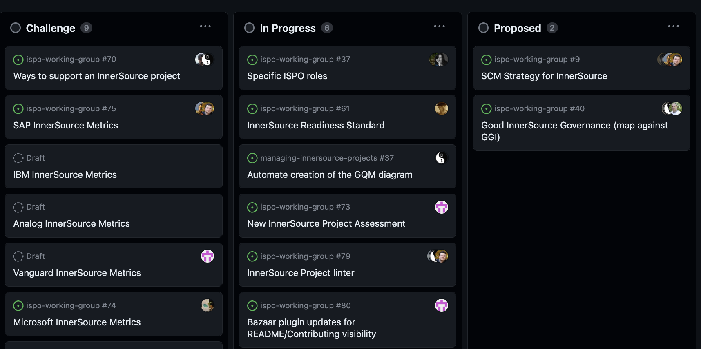
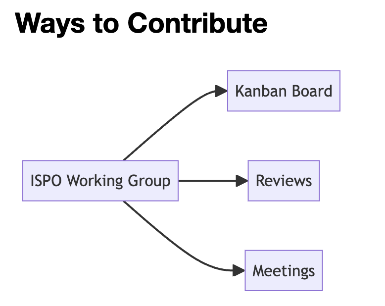
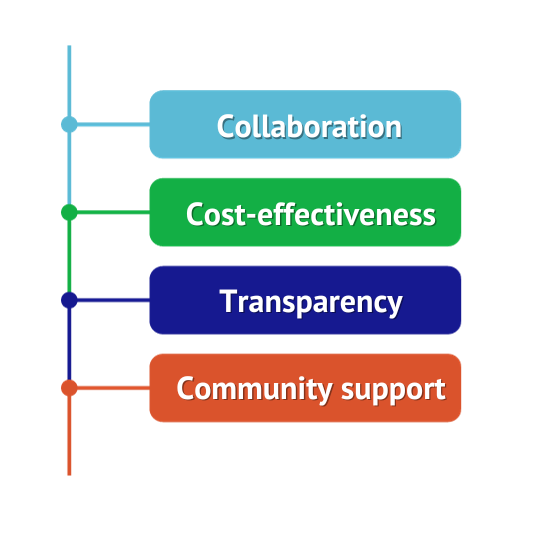

# The InnerSource Program Office (ISPO) Working Group
<!---  Slide 1: Opening Statement --->

The working group creates resources for enterprise InnerSource teams.

<!--
Hello, Jeff and I are going to talk to you today about the 
ISPO Working Group,   which is a working group within the InnerSource commons 
devoted to creating shared resources for people working on InnerSource at an Enterprise level.
-->

<!-- --- --> 

---

<!--- Slide 3: Key Message --->

But what is an InnerSource Program Office (ISPO)?

"Person(s) working on improving the internal code collaboration experience at full organization scale"

<!-- Slide 3: Key Message 

ISPO is an acronym. 
It stands for InnerSource Programs Office. 

We define it as "Person(s) working on improving the internal code collaboration experience at full organization scale".

-->

---

<!--- Slide 4: Key Message --->

## Lots of overlap

You don't formally need an ISPO team for this content to be useful

You might be concerned with InnerSource in any of these other teams.
<!-- Slide 4: Key Message:  

It is pretty rare that is there a team called the ISPO. 

Often the people doing InnerSource related work in a company are in a
team with a large scope of responsibilities and InnerSource is just
one aspect of that scope.

They might be in a team called the OSPO, or open source programming office, 
or part of a centralized engineering team, or a platforms team, or a
developer experience team.

They also could be single person working under the head engineering or as part of 
an engineering community of practice. 

When we say ISPO, what we really mean is anyone on any of those teams concerned 
with internal code collaboration at company-scale.

So if that sounds like you, then you are especially
who we are trying to reach today with this presentation and working group.

-->

---

<!--- Slide 5: Key Message --->

Q: WHY is the ISPO working group a subset of InnerSource Commons?

A: We focus on accelerating teams that run and support InnerSource across an organization rather than individuals.
<!-- Slide 5: Key Message:  

The ISPO working group focuses on a subset of the larger InnerSource Commons scope.

We focus on guidance for
the teams that run and support InnerSource across an enterprise or agency rather than guidance at the project or individual level. 

For example, in the InnerSource Commons patterns, there is guidance 
for how to be a good InnerSource maintainer and guidance on how to set up 
your project for InnerSource success. 

Those are important areas, but they are outside of
the scope of the working group. Instead, the working group focuses
on elements specific to centralized teams driving InnerSource at company-wide scale.

-->

---

<!--- Slide 6: Key Message --->

Our objective in this presentation is to help you discover the benefits of our ISPO working group.

https://github.com/InnerSourceCommons/ispo-working-group/blob/main/CONTRIBUTING.md

<!-- Slide 6: Key Message

Our goal for this talk is to help you learn about the 
ISPO working group and how it might benefit you.

In addition to the content in this talk, you can 
check out similar information in the contributing.md 
file of the ispo-working-group repository.

We will put it in the meeting chat. 
If you want to look at things during the talk, 
that's a great place to start.

https://github.com/InnerSourceCommons/ispo-working-group/blob/main/CONTRIBUTING.md
-->

---

<!--- Slide 7: Key Message --->

By participating in our working group 
**YOU** can increase the speed and impact of **YOUR** InnerSource Program Office.

<!-- Slide 7: Key Message

We have structured the working group such that 
by participating in the working group you can increase the speed and impact of your InnerSource Program Office.

The model the working group follows to do that is: 

- We create shared products, guidance docs, 
methodology descriptions, etc. based shared challenges that we have.

- These get peer reviewed from other InnerSource experts, 

- and then the final product gets reused internally by yourself and by others.

This improves the quality of work and enables us to move FASTER
than if we each did the work individually. 
-->

---

<!--- Slide 8: Key Message --->

Examples of products we are working on specifically for teams that drive InnerSource company-wide:

* InnerSource Project Metrics
* SCM (Source Code Management)
* InnerSource Project Assessment and Linting

<!-- Slide 8: Key Message

Examples of challenges we are working right on include:

* InnerSource Metrics
* SCM (Source Code Management)
* InnerSource Project Assessment and Linting tools

These are all challenges where many people in the working group have tried different things, have different lessons to share, 
and want to learn from the experience of others who have tried other 
approaches at their own companies. 
-->

---

<!--- Slide 10: Key Message --->

#### Source Code Management (SCM) is: 

"How do you set up GitHub, GitLab, etc. configuration at an enterprise level to best all the different needs across different types of teams, projects, etc."

<!-- Slide 10: Key Message 
One area I have contributed to 
is in defining guidance for source code management or SCM.

SCM refers to how you set up or configure a version control platform like 
GitHub, GitLab, Bit Bucket, etc. There are lots of decisions to be made in 
how these platforms are configured and different needs have to be balanced.

Shown on the slide is a screenshot of one part of our in-progress 
guidance document. 
It discusses how to balance needs of security and collaboration. 

These needs can sometimes conflict, resulting in 
disagreements. And in a worst case scenario, a single security 
event can result in a sudden lock down across the enterprise
that kills off collaboration.

By making guide from different perspectives and experiences, 
we are able to provide an improved framework for how to make
good configuration choices in version control platforms 
that balance the various needs, like security vs. collaboration. 

-->

---
<!--- Slide 11: Key Message --->

What did I get from contributing to Source Code Management project?

<!-- Slide 11: Key Message

The source code management challenge is one area where I have personally
participated in creating ISPO working group content. 

There are several reasons why I took part in this challenge area:

 First, to get more value from hard won lessons by sharing them with others.

 Second, I want my perspective in external resources, so I can later refer 
 to those external resources rather than just sharing an email with my
 personal opinion. Sharing a link to an 
 inner source commons product is more persuasive. 
 
 Third, I wanted to confirm my opinion is aligned with the experiences
 of others who have struggled through this at their company. 
 
 Fourth, sharing grows my network and provides opportunities to sense check
other ideas I might have in the future.
-->

---
<!--- Slide 12: Key Message --->

**What are InnerSource Metrics?**

InnerSource Metrics meaningfully demonstrate the value of InnerSource to our stakeholders.

*Example InnerSource Metrics*

👀 **Usage count** — how many times the InnerSource project is used.
🤝 **Code contributions** — Count of commits not from the project owner.

<!--
Thanks Justin, as previously shown we built an InnerSource metrics graph.

As ISPO leaders, we’re often asked to articulate the value of InnerSource to our stakeholders. Using the InnerSource Metrics graph, we can achieve this goal.

For example, we may want to find valuable projects by identifying who contributes to them. The code contributions metric helps us with this goal and answers our question.

By navigating and contributing to the goals, questions, metrics graph we can demonstrate the value of our InnerSource projects.
-->

---
<!--- Slide 13: Key Message --->

How did I benefit from collecting goals, questions, and metrics?

<!--
Through my involvement in the metrics project, I didn't just gather data; I built a network. I connected with professionals who, like me, were navigating the world of InnerSource metrics. 

As I contributed to this project, my professional network grew. As a result of these efforts, I'm connected to great, like-minded professionals ready to help expand the value of the InnerSource Commons.

Looking ahead, this experience isn't a one-time benefit. When my company expands InnerSource project measurement, we'll be steps ahead, armed with a deep understanding of diverse approaches.
-->

---
<!--- Slide 14: Key Message --->

## How the ISPO working group operates

Share challenges, collaborate, deliver.

<!--
So, how do we operate?

Through conversations, ideation, and sharing our challenges, we work together to build peer-reviewed content fit for your organizations.

We value progress over perfection, and encourage you to share your challenges and solutions with us.
-->

---
<!--- Slide 15: Key Message --->

## When?

### Asynchronously

💬 Slack  
⛙ GitHub Repositories  
📋 GitHub-based Kanban board  

### Synchronously

📆 Biweekly working group meetings  
👥 Mobbing sessions  

<!--
When do we collaborate?

Biweekly meetings, slack, GitHub, and mobbing sessions.
-->

---
<!--- Slide 16: Key Message --->

## How Do I Contribute?

1. Kanban board *(GitHub)*
2. Peer review *(GitHub)*
3. Focus on external products useful to others
   * Markdown books, website pages, and anything linkable from inside company resources or added to them.

<!--
All work within our group undergoes a peer review as it progresses through the Kanban board. We align our work with the goals and objectives of our companies while also contributing to the InnerSource Commons.

We contribute to the Managing InnerSource Projects Gitbook, InnerSource Patterns, and other projects relevant to leaders of ISPOs, OSPOs, and the like.
-->

---
<!--- Slide 17: Closing Point of View --->

***The ISPO working group can be your force multiplier!***

*What challenges are you facing?*

<!--
We invite you to align your company backlog with our working group. We can produce content at a lower cost and get feedback from deeply experienced people.

Is there a challenge you’ve facing today?
-->

---
<!--- Slide 18: Specific Action --->

Attend an ISPO working group meeting

Get meeting invites by adding an issue:

https://github.com/InnerSourceCommons/ispo-working-group/issues/new

<!--
Attend the ISPO working group meeting on November 20th at 8 AM. 
-->

---
<!--- Slide 19: Benefits of Action --->

Our InnerSource Working Group has the same benefits as open source.

<!--
We already know the benefits of Open Source. Our InnerSource Working Group provides the same benefits. 
Collaboration opportunities, code reuse, knowedge sharing through community, and more.
-->

---
<!--- Slide 20: Closing Statement --->

**Collaborate with us!**

* Join #ispo-working-group in our slack group: https://innersourcecommons.org/community/#ispo
* Get meeting invites: https://github.com/InnerSourceCommons/ispo-working-group/issues/new
* GitHub repository: https://github.com/InnerSourceCommons/ispo-working-group
* Kanban board: https://github.com/orgs/InnerSourceCommons/projects/4 

<!---
The InnerSource Program Office (ISPO) Working Group is an opportunity for those involved in enterprise-level software development.

Whether you're a member of an ISPO, OSPO, Platform Engineering Team, or other centralized groups, you'll find benefits .

Our group allows you to contribute and benefit from a wealth of shared experience, enhancing your organization's InnerSource capabilities.

As we wrap up with questions, join us at the InnerSource Program Office Working Group by navigating to the first link or scanning the QR code to join our Slack group.

Thank You
--->
